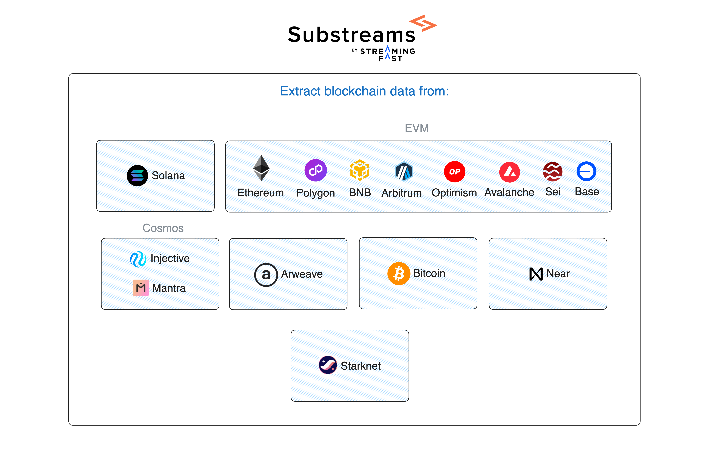

Substreams is a powerful and decentralized indexing technology, which allows you to:
- Extract data from several blockchains (Solana, Ethereum, Polygon, BNB...).
- Apply custom transformations to the data.
- Send the data to a place of your choice (for example, a Postgres database or a file).

<figure></figure>

**You can use Substreams packages to define which specific data you want to extract from the blockchain**. For example, consider that you want to retrieve data from the Uniswap v3 smart contract. You can simply use the [Uniswap v3 Substreams Package](https://substreams.dev/packages/uniswap-v3/v0.2.10) and send that data wherever you want!

## How Does It Work?

Visit the The following video covers how Substreams works in less than 2 minutes:


Get an overview of Substreams
